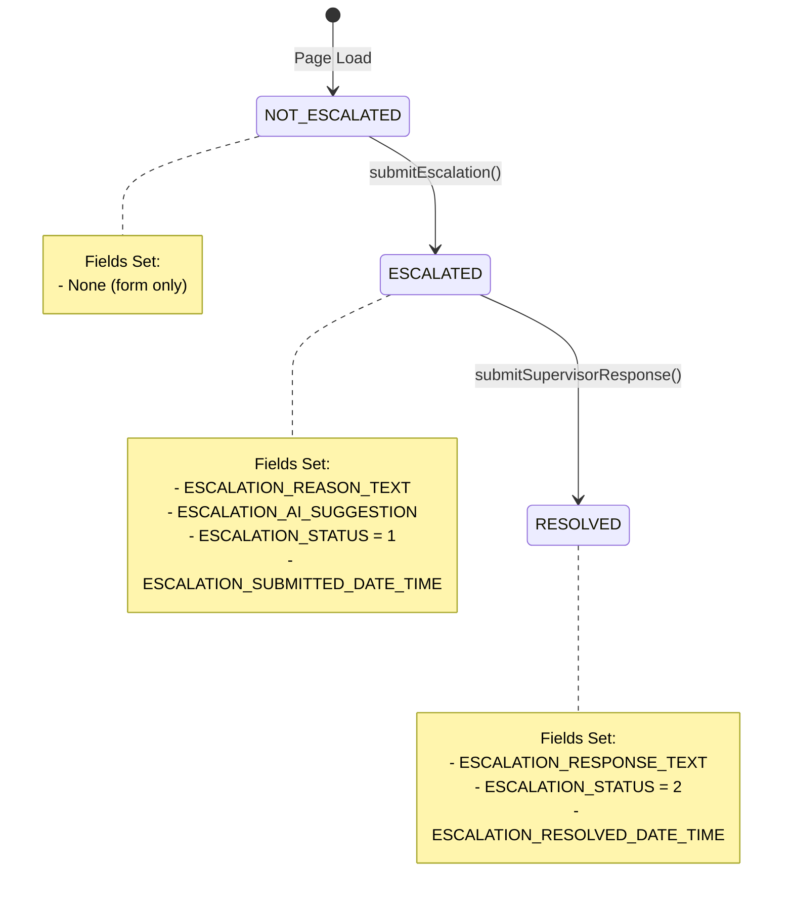

# Escalation v2 Custom Field & UI State Flow Diagram

## 📊 State Machine Overview

```
NOT_ESCALATED → ESCALATED → RESOLVED
    (Form)      (Awaiting)   (Complete)
```

---

## 🔄 Complete Field & UI Flow

### **STATE 1: NOT_ESCALATED (Initial)**

#### **Custom Fields Read:**
```javascript
ESCALATION_STATUS = 0 (UUID: bf10e6ce-bef9-4105-aa2c-913049e2d4ed)
  OR null/undefined/empty
```

#### **UI Rendered:**
```
┌─────────────────────────────────────┐
│  🚨 Escalate Task                   │
├─────────────────────────────────────┤
│  [Textarea: escalationText]         │
│  "Why does this task need           │
│   escalation?"                      │
│                                     │
│  [Button: Generate AI Summary]      │
│   → Triggers AI generation          │
│                                     │
│  [AI Summary Display Panel]         │
│   (Shows aiSummary if generated)    │
│                                     │
│  [Button: Submit Escalation]        │
│   (Enabled when text + AI summary)  │
└─────────────────────────────────────┘
```

#### **Local State Variables:**
- `escalationText` (string) - User input
- `aiSummary` (string) - AI generated summary
- `isGenerating` (boolean) - Loading state
- `isSubmitting` (boolean) - Submit state

---

### **ACTION 1: Generate AI Summary**

#### **Trigger:**
```javascript
User clicks "🤖 Generate AI Summary" button
```

#### **API Call:**
```javascript
POST /api/ai/generate-escalation-summary
Body: {
  task_id: task.id,
  reason: escalationText,
  context: { task, parent_task }
}
```

#### **Fields Written:**
```
NONE - Only updates local state
```

#### **Local State Update:**
```javascript
setAiSummary(data.summary)
setIsGenerating(false)
```

#### **UI Change:**
```
Blue panel appears with AI summary:
┌─────────────────────────────────────┐
│  🤖 AI Summary                      │
│  [Generated summary text]           │
└─────────────────────────────────────┘

Submit button becomes enabled
```

---

### **ACTION 2: Submit Escalation**

#### **Trigger:**
```javascript
User clicks "🚨 Submit Escalation" button
```

#### **API Call:**
```javascript
POST /api/task-helper/escalate/{task.id}
Body: {
  reason: escalationText,
  ai_summary: aiSummary,
  escalated_to: '',
  task_context: {...}
}
```

#### **Fields Written (Backend):**
```javascript
ESCALATION_REASON_TEXT = escalationText
ESCALATION_AI_SUGGESTION = aiSummary
ESCALATION_STATUS = 1 (UUID: 8dc15846-e8c7-43a8-b7b2-1e1a0e1d6497)
ESCALATION_SUBMITTED_DATE_TIME = Date.now()
```

#### **Page Behavior:**
```javascript
alert('Escalation submitted successfully!')
setTimeout(() => window.location.reload(), 1000)
```

---

### **STATE 2: ESCALATED (Awaiting Response)**

#### **Custom Fields Read:**
```javascript
ESCALATION_STATUS = 1 (UUID: 8dc15846-e8c7-43a8-b7b2-1e1a0e1d6497)
ESCALATION_REASON_TEXT = <stored reason>
ESCALATION_AI_SUGGESTION = <stored AI summary>
ESCALATION_SUBMITTED_DATE_TIME = <timestamp>
ESCALATION_RESPONSE_TEXT = null/empty (not yet responded)
```

#### **State Detection Logic:**
```javascript
const escalationStatus = getEscalationStatus(task)
const isEscalated = escalationStatus === 'ESCALATED' || reason || summary
const isResolved = escalationStatus === 'RESOLVED' || supervisorResponse
const isAwaitingResponse = isEscalated && !isResolved
```

#### **UI Rendered:**
```
┌─────────────────────────────────────┐
│  ⏳ Escalation Pending              │
│  Escalated on: Jan 8, 2025 2:30 PM │
├─────────────────────────────────────┤
│  📝 Escalation Reason               │
│  [Display: ESCALATION_REASON_TEXT]  │
│                                     │
│  🤖 AI Summary                      │
│  [Display: ESCALATION_AI_SUGGESTION]│
│                                     │
│  ─────────────────────────────────  │
│  📋 Provide Response                │
│  [Textarea: supervisorText]         │
│  "Enter your response..."           │
│                                     │
│  [Button: Submit Response]          │
└─────────────────────────────────────┘
```

#### **Local State Variables:**
- `supervisorText` (string) - Response input
- `isSubmitting` (boolean) - Submit state

---

### **ACTION 3: Submit Supervisor Response**

#### **Trigger:**
```javascript
User clicks "Submit Response" button
```

#### **API Call:**
```javascript
POST /api/task-helper/supervisor-response/{task.id}
Body: {
  response: supervisorText
}
```

#### **Fields Written (Backend):**
```javascript
ESCALATION_RESPONSE_TEXT = supervisorText
ESCALATION_STATUS = 2 (UUID: cbf82936-5488-4612-93a7-f8161071b0eb)
ESCALATION_RESOLVED_DATE_TIME = Date.now()
```

#### **Page Behavior:**
```javascript
alert('Response recorded successfully!')
setTimeout(() => window.location.reload(), 1000)
```

---

### **STATE 3: RESOLVED (Complete)**

#### **Custom Fields Read:**
```javascript
ESCALATION_STATUS = 2 (UUID: cbf82936-5488-4612-93a7-f8161071b0eb)
ESCALATION_REASON_TEXT = <original reason>
ESCALATION_AI_SUGGESTION = <AI summary>
ESCALATION_RESPONSE_TEXT = <supervisor response>
ESCALATION_SUBMITTED_DATE_TIME = <escalation timestamp>
ESCALATION_RESOLVED_DATE_TIME = <resolution timestamp>
```

#### **State Detection Logic:**
```javascript
const isResolved = escalationStatus === 'RESOLVED' || supervisorResponse
```

#### **UI Rendered:**
```
┌─────────────────────────────────────┐
│  ✅ Escalation Resolved             │
│  Resolved on: Jan 8, 2025 4:15 PM  │
├─────────────────────────────────────┤
│  📝 Original Reason                 │
│  [Display: ESCALATION_REASON_TEXT]  │
│                                     │
│  ✅ Resolution Response             │
│  [Display: ESCALATION_RESPONSE_TEXT]│
└─────────────────────────────────────┘
```

#### **No Actions Available:**
- Read-only display
- No form inputs
- No buttons

---

## 🔍 UUID Mapping Reference

### ESCALATION_STATUS Dropdown Values:
```javascript
0 → 'NOT_ESCALATED' → UUID: bf10e6ce-bef9-4105-aa2c-913049e2d4ed
1 → 'ESCALATED'     → UUID: 8dc15846-e8c7-43a8-b7b2-1e1a0e1d6497
2 → 'RESOLVED'      → UUID: cbf82936-5488-4612-93a7-f8161071b0eb
```

### Helper Function:
```javascript
function getDropdownValue(field) {
  if (field.id === FIELD_IDS.ESCALATION_STATUS) {
    if (field.value === 0) return 'NOT_ESCALATED';
    if (field.value === 1) return 'ESCALATED';
    if (field.value === 2) return 'RESOLVED';
  }
  return field.value;
}
```

---

## 📝 Field Write Summary Table

| Action | Field Updated | Value Written | When |
|--------|---------------|---------------|------|
| Generate AI Summary | *(none)* | *(local state only)* | User clicks AI button |
| Submit Escalation | ESCALATION_REASON_TEXT | escalationText | Submit escalation |
| Submit Escalation | ESCALATION_AI_SUGGESTION | aiSummary | Submit escalation |
| Submit Escalation | ESCALATION_STATUS | 1 (ESCALATED) | Submit escalation |
| Submit Escalation | ESCALATION_SUBMITTED_DATE_TIME | Date.now() | Submit escalation |
| Submit Response | ESCALATION_RESPONSE_TEXT | supervisorText | Submit response |
| Submit Response | ESCALATION_STATUS | 2 (RESOLVED) | Submit response |
| Submit Response | ESCALATION_RESOLVED_DATE_TIME | Date.now() | Submit response |

---

## 🎨 UI Color Coding

| State | Background | Icon | Purpose |
|-------|-----------|------|---------|
| NOT_ESCALATED | `bg-white border-gray-200` | 🚨 | Input form |
| ESCALATED | `bg-yellow-50 border-yellow-200` | ⏳ | Pending action |
| RESOLVED | `bg-green-50 border-green-200` | ✅ | Completed |

---

## 🔄 State Transition Triggers



---

## 🚨 Critical Debug Points

### State Detection Debug:
```javascript
console.log('🚨 [ESCALATION MODULE] State Detection:', {
    escalationStatus,      // Should be 'NOT_ESCALATED' | 'ESCALATED' | 'RESOLVED'
    reason,                // ESCALATION_REASON_TEXT value
    summary,               // ESCALATION_AI_SUGGESTION value
    supervisorResponse,    // ESCALATION_RESPONSE_TEXT value
    isEscalated,          // Boolean
    isResolved,           // Boolean
    isAwaitingResponse,   // Boolean
    statusFieldRaw: status // Raw field object
});
```

### API Error Handling:
```javascript
// AI Generation Error
if (!response.ok) {
    alert(errorMessage + technicalError);
    // Does NOT update any fields
}

// Submission Error
if (!response.ok) {
    alert('Failed to submit escalation');
    // Does NOT update any fields
}
```

---

## 🔐 Authentication Flow

Every API call uses session cookies:
```javascript
fetch(url, {
    credentials: 'include',  // Include session cookie
    headers: {
        'Content-Type': 'application/json'
    }
})

// If 401 response:
window.location.href = '/auth/login';
```

---

## 📌 Key Takeaways

1. **State is Server-Driven**: UI state determined by ESCALATION_STATUS field value
2. **No Partial States**: Each action updates ALL required fields atomically
3. **Page Reload Pattern**: After every field write, page reloads to show new state
4. **Local State Temporary**: All form inputs (escalationText, aiSummary, supervisorText) are temporary until submitted
5. **UUID Critical**: State detection relies on exact UUID matching for dropdown values
